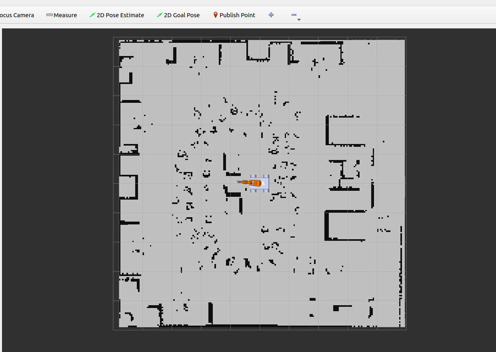
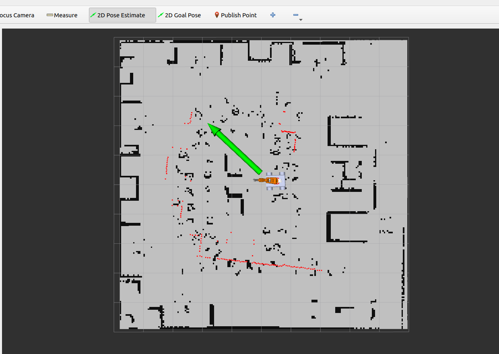

### Build the repo
```
rm -rf install/ log/ build/; colcon build --symlink-install
```

### Source the repo
```
source install/setup.bash
```

### Launch file for Gazebo + Rviz2 + Moveit2 (Move base & robotic arm)
```
ros2 launch irb120_ros2_moveit2 irb120.launch.py
```

### Launch file for grasping the object
```
ros2 launch irb120_ros2_moveit2 irb120_interface.launch.py
```

### For spawning the object
```
ros2 run ros2_grasping spawn_object.py --package "ros2_grasping" --urdf "box.urdf" --name "box" --x 0.5 --y -0.3 --z 0.75
```

### For picking and placing the object
```
ros2 run ros2_execution ros2_execution.py --ros-args -p PROGRAM_FILENAME:="cubePP" -p ROBOT_MODEL:="irb120" -p EE_MODEL:="schunk"
```

### Drive the robot
In another terminal
```
ros2 run rqt_robot_steering rqt_robot_steering
```

### For doing SLAM & Saving the Map
Launch the robot in gazebo: spawns robot in gazebo in fixed xyz as [1,2,0] , opens rviz
```
ros2 launch irb120_ros2_moveit2 irb120.launch.py
```
For creating map, put mode: mapping in params file. Then run following cmd in another terminal.
```
source install/setup.bash; ros2 launch slam_toolbox online_async_launch.py params_file:=/home/aarjan/Documents/syllabus/8thsem/robotics/mobile_robot_manipulator/src/mobile_manipulator_body/config/mapper_params_online_async.yaml
```

### Localization with slam_toolbox
We can do localization with slam_toolbox, for this put mode: localization and put proper path of the map in params file.\
In another terminal
```
source install/setup.bash; ros2 launch slam_toolbox online_async_launch.py params_file:=/home/aarjan/Documents/syllabus/8thsem/robotics/mobile_robot_manipulator/src/mobile_manipulator_body/config/mapper_params_online_async.yaml
```

### Localization with AMCL
Once we generated map with slam_toolbox we can use that map with other localization systems which might be better for different situations. One of the popular localization system is Adaptive Monte Carlo Localization(AMCL). Standard ros2 implementation of AMCL is part of nav2 stack.\
In another terminal
```
source install/setup.bash; ros2 run nav2_map_server map_server --ros-args -p yaml_filename:=src/mobile_manipulator_body/maps/office_map_save.yaml -p use_sim_time:=true
```
It keeps waiting, so to publish map from external run following cmd.\
In another terminal
```
source install/setup.bash; ros2 run nav2_util lifecycle_bringup map_server
```
After doing this previous saved map should load in rviz. Now we don't know where our robot is there's no localization running. So we run amcl to localize our robot in the loaded map.
```
ros2 run nav2_amcl amcl --ros-args -p use_sim_time:=true
```
It keeps waiting so run following cmd,\
In another terminal.
```
ros2 run nav2_util lifecycle_bringup amcl
```
So we need to give amcl a suggestion of where the robot is to start with. 
AMCL required to give initial 2D Pose Estimate viz rviz button on top.

#### 2D Position Estimate for AMCL



### Twist mux
```
ros2 run teleop_twist_keyboard teleop_twist_keyboard --ros-args -r /cmd_vel:=/cmd_vel_key
```
```
ros2 run twist_mux twist_mux --ros-args --params-file /home/aarjan/Documents/syllabus/8thsem/robotics/mobile_robot_manipulator/src/mobile_manipulator_body/config/twist_mux.yaml -r cmd_vel_out:=diff_cont/cmd_vel_unstamped
```

### Navigation
```
ros2 launch nav2_bringup navigation_launch.py use_sim_time:=true
```
